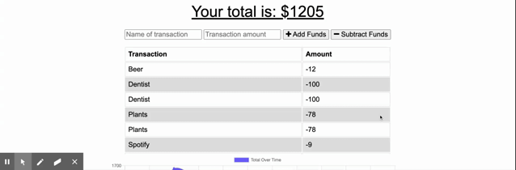
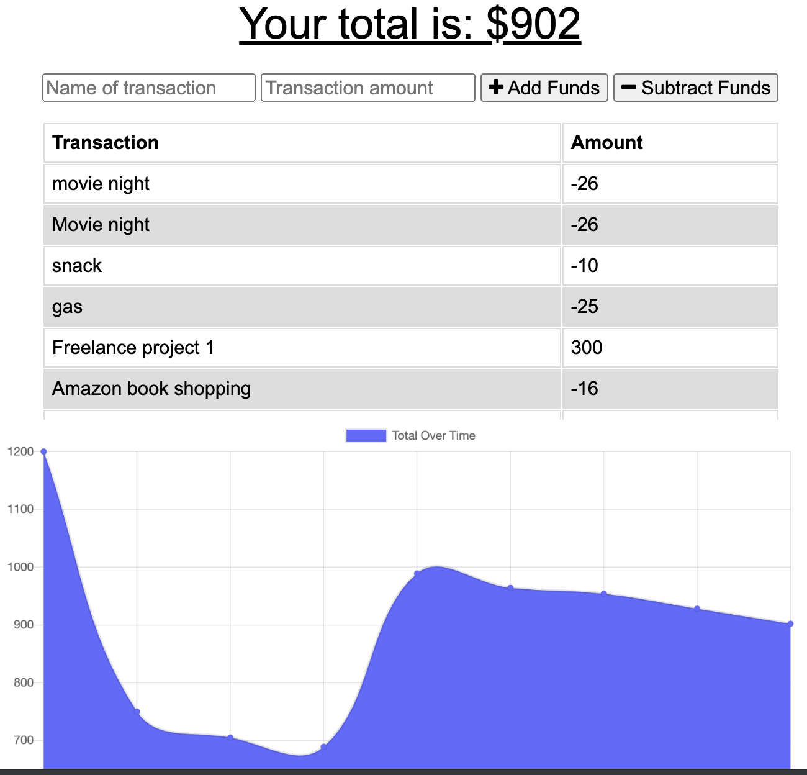

# Unit 18 PWA: Online/Offline Budget Tracker
​
---

​
1. [Description and User's Story](#description-and-user's-story)
2. [Functionalities](#functionalities)
3. [Dependencies and Libraries](#list-of-dependencies-and-libraries) 
4. [Installation](#installation)
5. [Demo](#demo)
6. [Licenses](#licenses)
7. [Credits and Acknowledgements](#credits-and-acknowledgements) 
​

​
---
​
## Description and User's Story 
​

​
​
``
AS a career professional,
I NEED an application where I can KEEP TRACK of my expenses and income
AND display a graph with the fluctuations of my monthly expenses.  
``
​

​
**Budget Tracker** is a Progressive Web Application (PWA) where the user can register income and deduct expenses from their monthly budget. The application displays the stats of currennt expenses in a chart. As a PWA, the application is fully functional online and offline.  
​

​
---
​
## Functionalities
​
Currently, the system offers the following *features*:
​
* Users can add an amount of income.
* Users can then add more momey to the account or deduct expenses from the savings. 
* Users can add the name/title/reference of expenses and the application lists all money transactions as a table. 
* Expenses and income are tracked and diplayed in a linechart. 
​

​
---
​
## Dependencies and Libraries
​
The application was designed and programmed through a combination of *JavaScript*, *pure HTML*, *pure CSS*, *Express*, *Node.Js* and *Bootstrap*. The database functionality was developed using MongoDB and the mongoose npm library. The application is functional and hosted in a *Heroku* external server. As a PWA, the application has a *manifest.json* and an online/offline *Service Worker*.
​
​
---
​
## Installation
​
If you are interested in running **Budget Tracker** locally, you can follow these steps:
​
1. Clone or download the repo.
​
2. Using your terminal, navigate into the main repository and run `npm install` in order to install all npm and NodeJS dependencies and libraries (you may also need to install MongoDB or change the database dialect of the schema file).
​​
4. After everything is set, you can then run the application using nodemon or `npm start` using Node in your terminal. After, navigate to your localhost connection on your preferred web browser. 
​
Or, alternatively, you can use the demo page we deployed on a [Heroku](https://www.heroku.com/platform) external server. You can access the functional app [here](https://vast-woodland-94625.herokuapp.com/). 
​

​
---
​
​
## Demo
​
The following Gif provides a demonstration of the application's functionalities:

​

---
​
## Licenses
​

​
---
​
## Credits and Acknowledgements
​
This project was expanded and finished, from the base assignment code, by:
​
* **Mario N. Castro Villarreal** [Github: mncastro](https://github.com/mncastro)
​